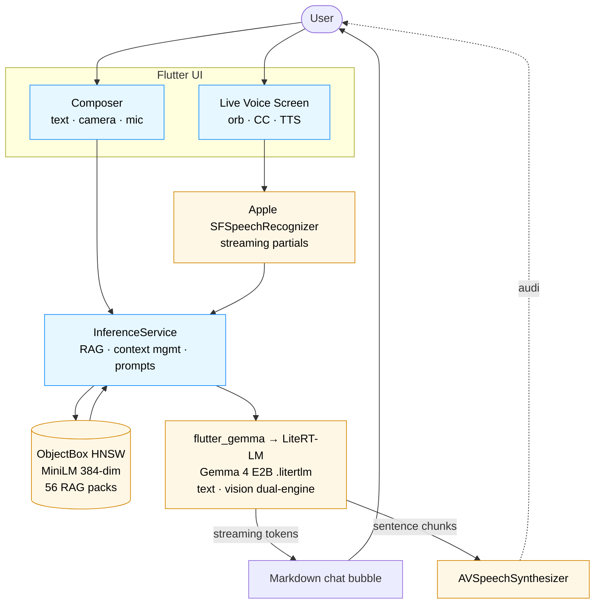

<div align="center">

# Ash

**Offline survival assistant for iOS.** Gemma 4 E2B runs fully on-device — text, image, and voice — so it works without signal.

[](LICENSE)
[](#)
[](https://flutter.dev)
[](https://huggingface.co/google/gemma-4-e2b-it)

</div>

---

## ✈️ Try it on your phone

The fastest path is TestFlight — no Xcode, no cables, no signing.

> **TestFlight invite:** _link will be added once Apple finishes processing build 1.4.0+2._
> Submission window: requires iPhone 15 Pro or newer on iOS 17+ and a Wi-Fi connection (~3 GB Gemma model download on first launch).

If you'd rather build from source — say, to swap models or hack on the RAG pipeline — see [Build from source](#-build-from-source) below.

---

## What Ash does

- **Survival Q&A, offline.** A curated RAG knowledge base (56 emergency-response packs — bleeding, hypothermia, water-finding, choking, fire-starting, …) is embedded with MiniLM and queried via ObjectBox HNSW. No network required after the model downloads.
- **Multimodal input.** Type, tap the camera to ask about what you're seeing, or hold the mic. Gemma 4's vision encoder handles photo input (~30 s warm-up on the first image, fast after).
- **Live voice mode.** Full-screen orb. Speak → SFSpeechRecognizer transcribes → Gemma 4 replies → AVSpeechSynthesizer reads each sentence aloud as it streams. Hands-free.
- **Per-chat tuning.** Temperature, top-K, top-P, max-context, RAG on/off, thinking mode — all live without restart for sampling changes, ~5 s engine reload for capacity changes.
- **Auto context management.** When you cross 85 % of the KV cache, Ash either extends it (up to 32k) or trims the oldest turns so live conversation never hits a hard stop.

---

## 🗺️ Architecture



**Inference.** `lib/services/gemma_inference_service.dart` wraps `flutter_gemma` 0.15.x. Text-only engine by default; auto-swaps to the vision engine on first image. Buffer-based EOS detection guards against subword-fragmented `<end_of_turn>` markers leaking past stop.

**RAG.** Question-style propositions are extracted from raw markdown survival guides by `tools/embed_propositions.py`, embedded with MiniLM, and stored in ObjectBox's HNSW index. Retrieval blends top-k by cosine distance with a confidence threshold.

**Voice.** Apple's native pipeline — no Whisper, no model download. STT supports on-device recognition when the language pack is installed (airplane-mode safe).

---

## 🛠️ Build from source

Prefer TestFlight if you just want to try the app. Build from source if you want to modify it.

**Prerequisites**

- macOS with Xcode 15 or newer
- Flutter ≥ 3.6
- A paid Apple Developer team (free profiles can't sign the multimodal engine — see [`docs/testflight-publishing.md`](docs/testflight-publishing.md) for required entitlements)
- iPhone 15 Pro / 16 Pro / 17 (A17+ for usable vision speed)

**Clone + install**

```bash
git clone https://github.com/yaoxiao6/Ash.git
cd Ash
flutter pub get
cd ios && pod install && cd ..
```

**Sign**

Open `ios/Runner.xcworkspace` once. Under **Runner → Signing & Capabilities**:

1. Set **Team** to your dev team.
2. Change **Bundle Identifier** if `com.yunxiang.ash` collides (it's globally unique).
3. Confirm `Increased Memory Limit` and `Extended Virtual Addressing` are present in `Runner.entitlements` — without them iOS Jetsam kills the vision encoder silently.

**Run on a real device**

```bash
flutter devices                         # find your iPhone's id
flutter run --release -d <iphone-id>
```

Release mode is mandatory — debug mode is too slow for the inference loop.

First launch downloads the Gemma 4 E2B `.litertlm` (~3 GB). Use Wi-Fi. Grant **Microphone**, **Speech Recognition**, and **Camera** when prompted.

For a deeper walkthrough — including the framework Info.plist fix for App Store error 90208 — see [`docs/testflight-publishing.md`](docs/testflight-publishing.md).

---

## Repo layout

```
lib/
├── main.dart                 # entrypoint — initializes flutter_gemma
├── app.dart                  # root widget, navigation, onboarding gate
├── screens/                  # chat · live voice · onboarding · settings · …
├── services/
│   ├── gemma_inference_service.dart    # Gemma 4 + RAG glue
│   ├── apple_voice_service.dart        # SFSpeechRecognizer + AVSpeech
│   └── context_estimator.dart          # KV-cache utilization tracker
├── models/                   # Chat, Pack, AppState
└── widgets/                  # chat bubble, glass surfaces, composer, …

assets/
├── models/minilm.onnx        # 86 MB MiniLM embedding model for RAG
└── rag/packs/                # 56 emergency-response knowledge packs

tools/
├── embed_propositions.py     # raw markdown → embedded RAG packs
├── rag_preprocessor.py       # bulk chunk + clean + embed
└── propositions/             # source markdown for the packs

ios/Runner/
├── AppDelegate.swift         # method channels (audio session)
├── Runner.entitlements       # memory limit entitlements
└── Info.plist                # usage descriptions

docs/
├── testflight-publishing.md  # verified TestFlight publishing workflow
└── superpowers/              # design plans + specs
```

---

## 🏆 Hackathon

Built for the **[Gemma 4 Good Hackathon](https://www.kaggle.com/competitions/gemma-4-good-hackathon)** (Kaggle × Google DeepMind, May 2026) — using Gemma 4's multimodal and on-device capabilities to make emergency knowledge available when it matters most: when there's no signal.

### Attribution

This app uses a specialized Gemma model for AI-powered features.
**Gemma is a trademark of Google LLC.**

Gemma 4 is released under the [Gemma Terms of Use](https://ai.google.dev/gemma/terms). The model weights are not redistributed by this repo — Ash downloads them at first launch from Google's public HuggingFace mirror.

### Credits

- **Gemma 4** — Google DeepMind
- **LiteRT-LM** — Google AI Edge team (via `flutter_gemma`)
- **MiniLM** — `sentence-transformers/all-MiniLM-L6-v2`
- Source knowledge packs adapted from public emergency-response and survival manuals (Red Cross, CDC, NOLS, DOT).

---

## License

This project is licensed under the [Apache License 2.0](LICENSE).

Built by [Yunxiang Yan](https://github.com/RaccoonOnion) and [Yao Xiao](https://github.com/yaoxiao6).
