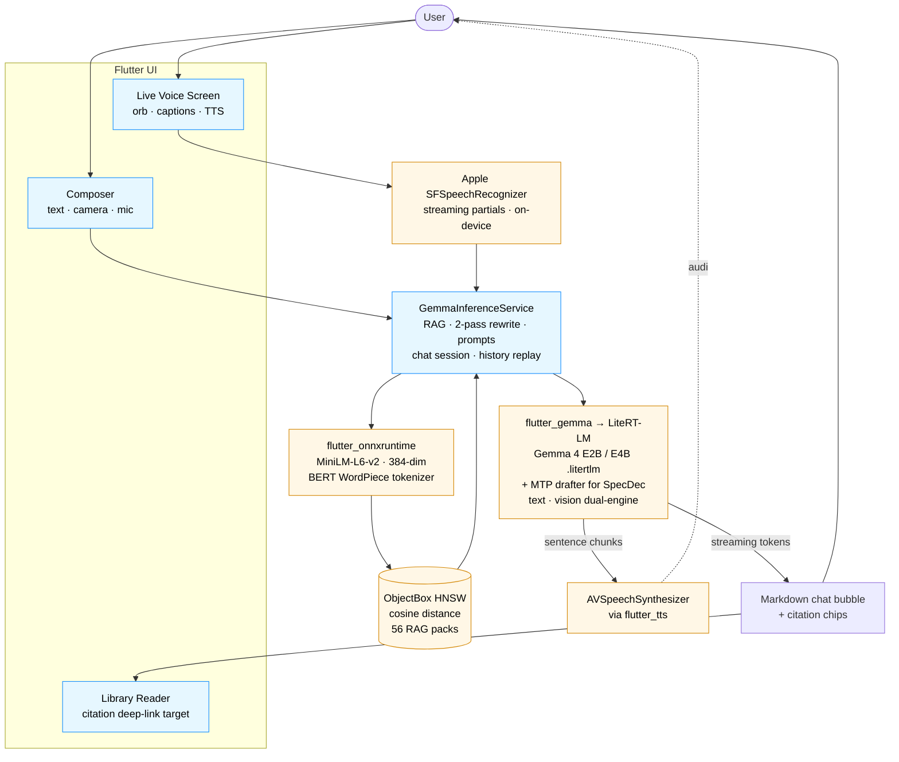

<div align="center">

# Ash

**Offline survival assistant for iOS.** Gemma 4 (E2B or E4B) runs fully on-device — text, image, and voice — so it works when there's no signal.

[](LICENSE)
[](#)
[](https://flutter.dev)
[](https://huggingface.co/litert-community)

</div>

---

## ✈️ Try it on your phone

The fastest path is TestFlight — no Xcode, no cables, no signing.

> **TestFlight invite:** _link added once Apple finishes processing build 1.4.0+7._
> Requires iPhone 15 Pro or newer on iOS 17+ and a Wi-Fi connection
> (~1.4 GB for E2B or ~3.7 GB for E4B on first launch).

If you'd rather build from source — to swap models, hack on the RAG pipeline,
or just see how it works — see [Build & run locally](#-build--run-locally)
below.

---

## What Ash does — feature walkthrough

### 1. Grounded survival Q&A — offline

Ash ships with **56 emergency-response knowledge packs** covering everything
from CPR and severe bleeding to flash floods, hypothermia, active shooter,
overdose, and nuclear fallout. Ask a question (text or voice) and the model
retrieves the most relevant chunks and replies with **inline `[1] [2]`
citations**. Tap a chip and the Library reader scrolls straight to the
exact chunk it pulled from, with a pulse highlight so you can verify the
source.

No network is needed after the model downloads. Airplane-mode safe.

### 2. Multimodal input — type, camera, mic

- **Text** — markdown rendering, code blocks, citation chips under each reply.
- **Image** — tap the camera button to ask about a photo (medication labels,
  wounds, foraging finds, road signs in foreign scripts). First image
  triggers a ~30 s vision-engine swap; subsequent images are fast.
- **Voice (hold-to-talk)** — partial transcripts arrive as you speak,
  powered by Apple SFSpeechRecognizer on-device.

### 3. Live voice mode

A full-screen orb. You speak → SFSpeechRecognizer transcribes → Gemma 4
replies → AVSpeechSynthesizer reads each sentence aloud as it streams. The
system prompt is swapped to a voice-tuned variant ("no markdown, 1-3
sentences, plain prose") so the TTS reads cleanly. Citation chips are still
captured silently and appear when you exit back to the text chat.

### 4. Two model sizes, hot-swappable

- **Gemma 4 E2B** (1.4 GB) — recommended default. Fast first token,
  iPhone 15 Pro and up.
- **Gemma 4 E4B** (3.7 GB) — stronger reasoning. Best on iPhone 17 Pro
  with ≥ 6 GB free RAM for the vision swap.

The Models tab lets you install both, switch the active variant, and watch
download progress with a live EMA-based ETA estimator. Active model swap
takes a few seconds (engine reload only — no re-download).

### 5. Per-chat tuning

Sampling (temperature / topK / topP), `maxTokens`, RAG on/off, and Gemma 4
**thinking mode** are all live-tunable from the chat-settings sheet:
- Sampling changes apply on the next message (chat session rebuild,
  history replayed automatically — keeps the model "in" the conversation).
- `maxTokens` changes trigger an engine reload (~5 s text-only,
  ~30 s vision-capable).
- RAG and thinking flags flip without restart.

### 6. Auto context management

When the projected KV-cache utilization crosses 85 %, the composer shows
a warning banner with two one-tap actions: **extend** (bump `maxTokens`
up to 32 k, with the engine reload that implies) or **trim older
messages** (drop the oldest 30 % of turns and reset the chat session so
the model's memory matches what you see).

### 7. Library lens — pin a chat to a pack

Open a pack from the Library and tap "Ask Ash about this" to start a chat
scoped to that pack only. HNSW retrieval is narrowed to chunks within the
selected pack(s), so a "How do I do compressions?" question pinned to the
CPR pack won't bleed into adjacent first-aid material.

---

## 🗺️ Architecture overview



### Models and runtimes

Ash combines **six** on-device ML components — two generative LLMs and four
supporting models / indexes:

| Component | Role | Where |
|-----------|------|-------|
| **Gemma 4 E2B-it** (1.4 GB) | Primary inference. Text + vision. Default. | HuggingFace `litert-community/gemma-4-E2B-it-litert-lm` — downloaded on first launch |
| **Gemma 4 E4B-it** (3.7 GB) | Higher-quality inference. Optional. | HuggingFace `litert-community/gemma-4-E4B-it-litert-lm` |
| **MTP drafter** | **Speculative decoding** — Multi-Token Prediction. ~1.5–2× decode speedup. | Bundled inside the same `.litertlm` blob as each Gemma 4 variant; enabled via `enableSpeculativeDecoding: true` on the LiteRT-LM engine |
| **MiniLM-L6-v2** (86 MB) | RAG **embedding model**. Encodes user queries and pack chunks into 384-dim vectors. | `assets/models/minilm.onnx` — bundled in the IPA |
| **ObjectBox HNSW index** | **Vector search**. Cosine-distance graph index over the embeddings. | Built incrementally as packs are imported; persisted in the app's container |
| **Apple SFSpeechRecognizer** | **Speech-to-text**. On-device when the language pack is installed (airplane-mode safe), streaming partial transcripts. | iOS system framework, accessed via `speech_to_text` plugin |
| **Apple AVSpeechSynthesizer** | **Text-to-speech**. Sentence-level streaming during model decode. | iOS system framework, accessed via `flutter_tts` |

The LLM **inference engine** is LiteRT-LM, Google AI Edge's mobile runtime
for `.litertlm` files. Default backend is **Metal (GPU)** for thermals and
speed; CPU is the fallback when the GPU delegate misbehaves on the vision
encoder. See [`ASH_TECHNICAL_DOC.md`](ASH_TECHNICAL_DOC.md) (internal) for
the GPU rebuild / SIGSEGV workaround and the rest of the gory details.

---

## 🛠️ Build & run locally

Prefer TestFlight if you just want to use the app. Build from source if you
want to modify it.

### Prerequisites

- macOS with **Xcode 15+**
- **Flutter ≥ 3.6** (`flutter doctor` clean)
- **CocoaPods** (`pod --version` shows 1.13+)
- A **paid Apple Developer team** (free profiles can't sign the multimodal
  engine — without the memory entitlements, iOS Jetsam silently kills the
  vision encoder during load)
- An **iPhone 15 Pro / 16 Pro / 17** on iOS 17 or newer (A17 chip or
  better for usable vision latency)
- USB cable for the first run (over-the-air flutter run works after pairing,
  but the first install needs a wired session)

### 1. Clone + dependencies

```bash
git clone https://github.com/RaccoonOnion/ash.git
cd ash
flutter pub get
cd ios && pod install && cd ..
```

### 2. Sign

Open `ios/Runner.xcworkspace` in Xcode. Under **Runner → Signing &
Capabilities**:

1. Set **Team** to your Apple Developer team.
2. Change **Bundle Identifier** if `com.yunxiang.ash` collides — bundle IDs
   are globally unique across the App Store. Pick something under a domain
   you own.
3. Verify these capabilities exist (they're already in
   `ios/Runner/Runner.entitlements` — Xcode will surface a yellow warning
   if your team doesn't have them enabled):
   - `Extended Virtual Addressing`
   - `Increased Memory Limit`

   Without both, the vision encoder will SIGKILL silently mid-load.

### 3. (Optional) HuggingFace token

The default Gemma 4 LiteRT mirrors are public, but a token raises your
rate-limit headroom on slow connections. Generate a read-only token at
<https://huggingface.co/settings/tokens> and pass it through to the build:

```bash
export HF_TOKEN=hf_...     # then add --dart-define below
```

### 4. Find your device

```bash
flutter devices
```

Copy the iPhone's ID from the output (looks like
`00008150-000579DC2198401C`).

### 5. Run on device — Release mode

```bash
flutter run --release -d <iphone-id> \
    --dart-define=HUGGINGFACE_TOKEN=$HF_TOKEN
```

**Release mode is mandatory.** Debug mode is too slow for the inference
loop and can't keep up with TTS streaming.

### 6. First launch on the device

1. Grant **Microphone**, **Speech Recognition**, **Camera**, and
   **Notifications** when prompted.
2. Pick a model on the onboarding screen — **Gemma 4 E2B is the
   recommended default**. The download is ~1.4 GB on Wi-Fi (≈ 12 min on
   typical home Wi-Fi); E4B is ~3.7 GB. Live ETA shown.
3. Once the download finishes you're in chat. Try:
   - "How do I stop heavy bleeding?" — should retrieve from the
     **bleeding** pack.
   - Tap the camera button + ask a question about a photo.
   - Tap the live-voice button (waveform icon) for full-screen voice mode.

### 7. Build an IPA for TestFlight (optional)

```bash
flutter build ipa --release \
    --export-method=app-store \
    --dart-define=HUGGINGFACE_TOKEN=$HF_TOKEN
./ios/fix_framework_plists.sh   # patches MinimumOSVersion in bundled frameworks
                                # — required or App Store Connect rejects with error 90208
```

The fixed IPA lands at `build/ios/ipa-fixed/ash.ipa`. Upload via Transporter
or `xcrun altool`. See [`docs/testflight-publishing.md`](docs/testflight-publishing.md)
for the full publishing walkthrough.

---

## 📁 Repo layout

```
lib/
├── main.dart                              # FlutterGemma.initialize + runApp
├── app.dart                               # root widget, navigation, downloads
├── screens/
│   ├── chat_screen.dart                   # main chat composer + messages
│   ├── live_voice_screen.dart             # orb · captions · TTS-on-stream
│   ├── pack_reader_screen.dart            # citation deep-link target
│   ├── models_screen.dart                 # per-variant install / switch
│   ├── model_download_screen.dart         # ring + EMA ETA
│   ├── knowledge_screen.dart              # library tab
│   ├── settings_screen.dart               # accelerator · speculative · voice
│   └── ...                                # onboarding · profile · model pick
├── services/
│   ├── inference_service.dart             # abstract interface
│   ├── gemma_inference_service.dart       # flutter_gemma + RAG implementation
│   ├── llm_model.dart                     # Gemma 4 E2B / E4B enum + HF urls
│   ├── inference_settings.dart            # per-chat tuning struct
│   ├── apple_voice_service.dart           # SFSpeechRecognizer + AVSpeech
│   ├── bert_tokenizer.dart                # WordPiece for MiniLM
│   ├── chunk_entity.dart                  # ObjectBox @HnswIndex 384-dim
│   ├── chunk_sanitizer.dart               # markdown cleaning
│   ├── tts_sanitizer.dart                 # strip markdown for TTS
│   ├── context_estimator.dart             # KV-cache load projection
│   └── model_download_state.dart          # state machine + EMA ETA
├── models/                                # Chat, ChatMessage, MessageSource, Pack
└── widgets/                               # citation chips, glass surfaces,
                                           # composer, chat bubble, settings sheet…

assets/
├── models/
│   ├── minilm.onnx                        # 86 MB MiniLM-L6-v2 (RAG embedding)
│   └── vocab.txt                          # BERT WordPiece vocab
└── rag/
    ├── chunks.json                        # seed chunks (preprocessed)
    └── packs/                             # 56 emergency-response packs

tools/
├── embed_propositions.py                  # raw markdown → MiniLM embeddings
├── rag_preprocessor.py                    # bulk chunk + clean + embed
├── rechunk.py                             # re-chunking utility
└── propositions/                          # source markdown per pack

ios/
├── Runner/
│   ├── Runner.entitlements                # memory limit + virtual addressing
│   ├── Info.plist                         # usage descriptions
│   └── AppDelegate.swift
├── Podfile
└── fix_framework_plists.sh                # MinimumOSVersion fix for AppStore 90208

docs/
└── testflight-publishing.md               # TestFlight publishing runbook
```

---

## 🏆 Hackathon

Built for the **[Gemma 4 Good Hackathon](https://www.kaggle.com/competitions/gemma-4-good-hackathon)**
(Kaggle × Google DeepMind, May 2026) — putting Gemma 4's multimodal and
on-device capabilities to work so emergency knowledge is available when
it matters most: when there's no signal.

### Attribution

This app uses Google's Gemma 4 models for inference. **Gemma is a trademark
of Google LLC.** Gemma 4 is released under the
[Gemma Terms of Use](https://ai.google.dev/gemma/terms). Model weights are
not redistributed by this repo — Ash downloads them at first launch from
the public `litert-community` HuggingFace mirror.

### Credits

- **Gemma 4 (E2B-it / E4B-it)** — Google DeepMind.
- **LiteRT-LM** — Google AI Edge team. Mobile runtime for `.litertlm` files;
  also ships the MTP drafter that makes speculative decoding work.
- **[`flutter_gemma`](https://pub.dev/packages/flutter_gemma)** — community
  Flutter wrapper around LiteRT-LM. Without it this app wouldn't have a
  chance of fitting in a hackathon timeline.
- **MiniLM-L6-v2** — `sentence-transformers/all-MiniLM-L6-v2`. Tiny,
  L2-normalized, 384-dim — perfect for on-device RAG.
- **[ObjectBox](https://objectbox.io/)** — embedded vector DB with
  on-device HNSW.
- **[Project N.O.M.A.D.](https://github.com/Tearran/nomad-mvp)** — content
  taxonomy + offline-knowledge architecture inspiration. Nomad is a
  Debian-based self-hosted offline knowledge server; Ash borrows its
  curated-survival-content model and bends it to fit a single iPhone.
- **[HazAdapt](https://hazadapt.com/)** — primary scaffold for the
  emergency-response pack content (hazard taxonomy, situational
  before/during/after structure). Additional material from American Red
  Cross, CDC, NOLS, and DOT public guides.

---

## License

This project is licensed under the [Apache License 2.0](LICENSE).

Built by [Yunxiang Yan](https://github.com/RaccoonOnion) and
[Yao Xiao](https://github.com/yaoxiao6).
